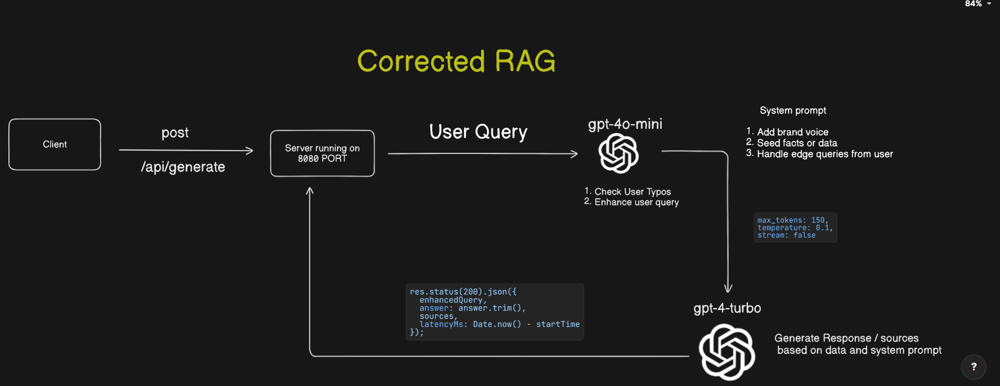

# Trade Offs/Gaps

- Using two LLMs → better accuracy but higher latency
   
- No vector embeddings → limited retrieval capability
   

#### Trade Offs reasons:
- Accuracy should be our priority, latency or speed can be achieved by adding more GPUs.
- vector embeddings not needed for simple responses.

# Next Steps
- Add LLM as a judge or Use Hyde concept and ranking for accuracy.
- Reduce the latency.

# Flow Diagram

